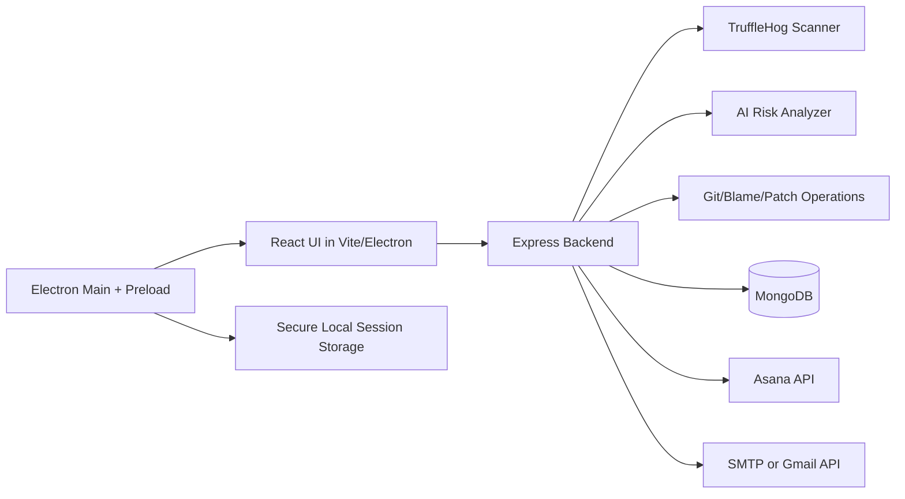

# SecureScan

SecureScan is a full-stack secure development workflow tool that detects leaked secrets in source code, attributes findings to contributors, helps auto-remediate hardcoded credentials, and tracks security posture for both solo developers and organizations.

The project includes:

- A Node.js backend API for scanning, persistence, remediation, auth, and integrations.
- A React + Vite frontend for scan operations, dashboards, and vulnerability reporting.
- An Electron desktop shell that runs the frontend and backend together with secure local token storage.

---

## What This Project Does

SecureScan provides a complete lifecycle from discovery to resolution:

1. Scan
   - Scans Git repositories or ZIP archives using TruffleHog.
   - Supports standard scan mode and remediation session mode.
2. Analyze and classify
   - Parses scanner output, filters noisy findings, and enriches candidate secrets with an AI risk analyzer.
3. Attribute ownership
   - Uses git blame metadata where possible to identify likely responsible contributors.
4. Persist security records
   - Stores normalized vulnerabilities in MongoDB with deduplication by fingerprint.
5. Remediate
   - Creates patch previews, applies replacements, updates environment references, and generates git diffs.
6. Ship and verify
   - Commits/pushes remediation changes, then verifies by re-scanning post-push state.
7. Coordinate teams
   - Supports organization member management and invite flows.
   - Can create Asana remediation tasks and send notification emails.

---

## High-Level Architecture



### Runtime modes

- Web mode: run backend and frontend separately.
- Desktop mode: run Electron dev command to launch backend + Vite + Electron together.

---

## Repository Structure

```text
project-root/
  back/        # Express API, scanning engine, remediation, auth, DB models
  client/      # React + Vite dashboard and scan UI
  electronjs/  # Electron shell, IPC bridge, session/token persistence
```

### Backend highlights

- `back/server.js`
  - Scanner endpoints (`/scan-*`)
  - Remediation endpoints (`/patch/*`)
  - Task integration endpoint (`/integrations/tasks`)
- `back/services/remediation.js`
  - Patch preview/apply/diff/commit/rollback pipeline
- `back/services/vulnerabilityPersistence.js`
  - Deduplicated vulnerability persistence + stale finding resolution
- `back/services/projectManagement.js`
  - Asana task creation + email notification
- `back/controllers/*`, `back/routes/*`
  - Modern auth/org APIs and legacy compatibility APIs

### Frontend highlights

- `client/src/pages/Dashboard/pages/Scans.tsx`
  - Primary scan and remediation workflow UI
- `client/src/pages/Dashboard/pages/OrganizationVulnerabilities.tsx`
  - Organization vulnerability table with filters
- `client/src/context/Auth.tsx`
  - Session bootstrap, token handling, role-aware state

### Electron highlights

- `electronjs/main.js`
  - Launches Vite in dev mode or built UI in dist mode
  - Handles secure token/session storage and PDF save dialog via IPC
- `electronjs/preload.js`
  - Exposes safe APIs to renderer (`window.electronAPI`)

---

## Feature Set

### 1. Secret scanning

- Scan Git URL (`/scan-url`)
- Scan ZIP archive (`/scan-zip`)
- Ignore noisy paths like lock files and build artifacts
- Apply entropy/false-positive filters
- Optional AI-assisted confidence/risk enrichment

### 2. Remediation sessions

- Session-based scan mode (`/scan-url-remediation`, `/scan-zip-remediation`)
- Patch preview (`/patch/preview`)
- Patch apply (`/patch/apply`)
- Git diff view (`/patch/diff`)
- Commit + optional push (`/patch/commit`)
- Post-push verification scan (`/patch/verify`)
- Rollback by revert (`/patch/rollback`)

### 3. Identity and access

- JWT auth with roles:
  - `SOLO_DEVELOPER`
  - `ORG_OWNER`
  - `EMPLOYEE`
- Organization membership and invite acceptance flow
- Role-aware vulnerability visibility

### 4. Vulnerability intelligence

- Normalized vulnerability records:
  - repo, branch, file, line, secret type, severity, author, status
- Status lifecycle:
  - `OPEN`, `FIXED`, `IGNORED`
- Dashboard summaries by repo, branch, and developer

### 5. Team workflow integration

- Asana task creation for remediation assignment
- Optional email notification via:
  - Gmail OAuth2 API, or
  - SMTP fallback

### 6. Desktop UX support

- Electron session persistence for auth token + GitHub token
- Local PDF save integration for generated reports

---

## API Surface (Core)

### Scan endpoints

- `POST /scan-url`
- `POST /scan-zip`
- `POST /scan-url-remediation`
- `POST /scan-zip-remediation`

### Remediation endpoints

- `POST /patch/preview`
- `POST /patch/apply`
- `POST /patch/diff`
- `POST /patch/commit`
- `POST /patch/verify`
- `POST /patch/rollback`

### Task integration

- `POST /integrations/tasks`

### Modern auth endpoints

- `POST /api/auth/register`
- `POST /api/auth/login`
- `POST /api/auth/logout`
- `GET /api/auth/me`
- `GET /api/auth/invite/:token`
- `POST /api/auth/invite/accept`
- `POST /api/auth/set-password`
- `GET /api/auth/vulnerabilities`
- `GET /api/auth/vulnerabilities/summary`

### Organization endpoints

- `POST /api/organizations/create`
- `GET /api/organizations/:id`
- `GET /api/organizations/:id/members`
- `POST /api/organizations/:id/invite`
- `GET /api/organizations/:id/invites`
- `GET /api/organizations/:id/vulnerabilities`
- `GET /api/organizations/:id/vulnerabilities/summary`
- `GET /api/organizations/:id/repos`
- `GET /api/organizations/:id/branches`
- `GET /api/organizations/:id/developers`

### Legacy compatibility endpoints

Legacy routes are still mounted under `/api/*` in `back/routes/user.js` for backward compatibility with older frontend paths.

---

## Data Model Summary

### User

- Email, password, role, organization/company references, activity state

### Organization

- Owner, members, invite tokens/status

### Repository

- git URL, branch/status metadata, aggregate verification counts

### Vulnerability

- Fingerprinted secret findings with severity/status and ownership metadata

---

## Prerequisites

- Node.js 18+
- npm
- MongoDB connection string
- Git
- TruffleHog available via one of:
  - `TRUFFLEHOG_PATH`, or
  - bundled binary in `back/tools/trufflehog`, or
  - system `trufflehog` in PATH
- Git LFS recommended (repo tracks large binaries via LFS)

---

## Environment Configuration

Create `back/.env` (use `back/.env.example` as template).

### Core

- `MONGODB_URI`
- `SECURE_SCAN_AI_URL` (optional override for AI analyzer)
- `TRUFFLEHOG_PATH` (optional override to scanner binary)
- `JWT_SECRET`
- `JWT_EXPIRES_IN`

### Organization invites

- `LEAKSHIELD_INVITE_BASE_URL` (example: `http://localhost:5173/invite/accept`)

### Asana task integration

- `ASANA_ACCESS_TOKEN`
- `ASANA_WORKSPACE_GID`
- `ASANA_PROJECT_GID`
- `REMEDIATION_TASK_DUE_DAYS`

### Email for invite/task notifications

Option A: Gmail OAuth2

- `GOOGLE_OAUTH_USER`
- `GOOGLE_OAUTH_CLIENT_ID`
- `GOOGLE_OAUTH_CLIENT_SECRET`
- `GOOGLE_OAUTH_REFRESH_TOKEN`
- `GOOGLE_OAUTH_ACCESS_TOKEN` (optional)

Option B: SMTP

- `SMTP_HOST`
- `SMTP_PORT`
- `SMTP_SECURE`
- `SMTP_USER`
- `SMTP_PASS`
- `SMTP_FROM`

---

## Local Development

## 1) Install dependencies

```bash
cd back && npm install
cd ../client && npm install
cd ../electronjs && npm install
```

## 2) Run backend only

```bash
cd back
npm run dev
```

Backend runs on `http://localhost:3000`.

## 3) Run frontend only

```bash
cd client
npm run dev
```

Frontend runs on `http://localhost:5173`.

## 4) Run full desktop stack (recommended for project demo)

```bash
cd electronjs
npm run dev
```

This launches:

- Vite frontend
- Backend API
- Electron desktop shell

---

## Typical User Flows

### Solo developer

1. Register/login
2. Scan repo or ZIP
3. Review findings and snippets
4. Preview/apply remediation patches
5. Commit/push fixes and verify clean state
6. Review report dashboard

### Organization owner

1. Register as org owner or create organization
2. Invite team members
3. Scan repositories and monitor vulnerabilities org-wide
4. Filter by repo/branch/developer
5. Create Asana remediation tasks for contributors

### Employee

1. Accept invite and set password
2. View assigned or visible vulnerabilities
3. Fix and verify remediation on owned findings

---

## Security and Operational Notes

1. Remove all hardcoded credentials before production use.
2. Set a strong `JWT_SECRET` in environment for production.
3. Ensure SMTP/OAuth credentials are stored only in secure secret managers.
4. Prefer HTTPS and trusted networking for deployed backend APIs.
5. Review legacy endpoints before exposing externally; keep only required routes.

---

## Build and Packaging

### Build frontend

```bash
cd client
npm run build
```

### Run Electron against built frontend

```bash
cd electronjs
npm run start:dist
```

### Build desktop installer

```bash
cd electronjs
npm run dist
```

---

## Troubleshooting

### Scanner unavailable

- Verify TruffleHog is installed or `TRUFFLEHOG_PATH` points to executable.
- If using bundled binary, ensure LFS files are pulled.

### Backend not reachable from UI

- Confirm backend is running on port `3000`.
- Confirm frontend/API URLs point to localhost in your current environment.

### Push/commit failures in remediation

- Verify Git identity, branch permissions, and token scopes.
- For GitHub push, ensure token has repository write permissions.

### Email not sent

- Verify either Gmail OAuth2 or SMTP config is complete.
- Check backend logs for mail transport errors.

---

## Current State Notes

- The codebase includes both modern auth/organization APIs and legacy company/employee routes.
- Frontend currently calls localhost API URLs directly in multiple components.
- Remediation and task orchestration are integrated into the main scan workflow.

---

## Team

SecureScan is a secure development and remediation platform focused on practical detection-to-fix workflow automation.
